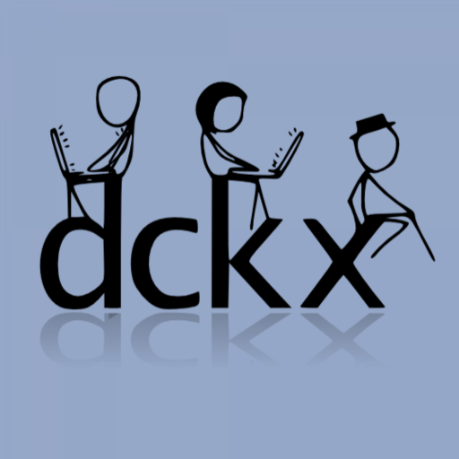

# dckx
xkcd: A webcomic of romance, sarcasm, math, and language created by Randall Munroe.

Now here comes dckx: an xkcd comics reader. dckx is the most fun way of reading xkcd in your iPhone, back-to-back.

Features include:

- Magnify the panels in the comics by tapping the left and right sides of the comics. This is the best way to read the comics panel by panel. No need to pinch to zoom.

- Dark theme support.

- What Ifs - yes, we include xckd's What Ifs.

- Comics and What Ifs lists, which you can filter.

- Bookmarks

- Read/seen Comics and What Ifs are marked.

- xkcd's own fonts are used throughout the app, or you can switch to iOS's system fonts if you want.
 

## Cloning and Building

```
$ git clone https://github.com/vito-royeca/dckx.git 
$ cd dckx 
$ pod install
$ open dckx.xcworkspace
```

## Author
Vito Royeca
https://vitoroyeca.com

